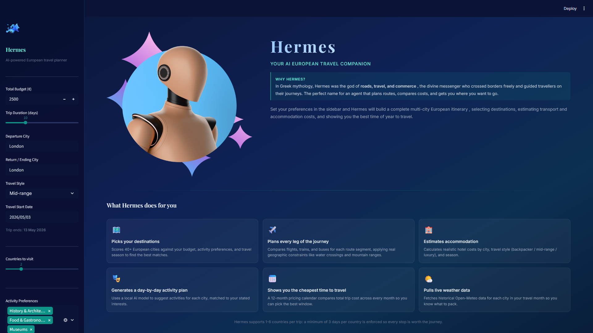

# Hermes - AI European Travel Planner

> An AI agent that builds personalised multi-city European itineraries with live weather data, transport comparison, accommodation estimates, and a 12-month pricing calendar. Runs entirely on your local machine with no paid API keys required.

<p align="center">
  
</p>

---

## Why Hermes?

The name comes from Greek mythology. Hermes was the god of roads, travel, trade, and commerce, the divine messenger who crossed borders freely, guided travellers on their journeys, and facilitated exchange between people and places. No figure in the ancient world was more closely tied to the act of moving through the world.

I grew up reading Greek, Roman, and Egyptian mythology and have always found the character of Hermes fascinating. He is not the strongest or the most powerful of the gods, but he is the most useful. The one who gets things done, connects distant points, and makes journeys possible. That felt like exactly the right spirit for a travel planning agent.

The name also works on a practical level. Hermes sits at the intersection of the three things this agent does: plan routes (roads), estimate costs (commerce), and help you see the world (travel). It is a name worth being proud of.

---

## Table of Contents

1. [Why Hermes?](#why-hermes)
2. [How This Project Started](#how-this-project-started)
3. [How the Agent Evolved](#how-the-agent-evolved)
4. [How the Website Evolved](#how-the-website-evolved)
5. [What Hermes Looks Like](#what-hermes-looks-like)
6. [Prerequisites](#prerequisites)
7. [Installation](#installation)
8. [Running the App](#running-the-app)
9. [How Hermes Plans Your Trip](#how-hermes-plans-your-trip)
10. [What You Can Customise](#what-you-can-customise)
11. [Project Structure](#project-structure)
12. [Running the Tests](#running-the-tests)
13. [Limitations](#limitations)
14. [Data Sources](#data-sources)

---

## How This Project Started

**Phase 1 - Gemini + Google APIs**

The first version used Google's Gemini API as the language model brain, combined with several Google APIs (Places API for location data, Directions API for routing). The idea was to let Gemini reason about the whole trip end-to-end and call the Google APIs as tools. The results looked promising on paper but came with real problems:

- Every test run cost money through the API
- Rate limits kicked in during development, breaking the flow
- Gemini's tool-calling was inconsistent - it would hallucinate parameters or skip tool calls entirely
- Debugging was slow because each failed run used up quota

**Phase 2 - Switching to Ollama**

After burning through credits and hitting walls with reliability, the project moved to [Ollama](https://ollama.com) running `llama3.1:8b` locally. This turned out to be a much better fit for the project:

- Zero cost per run - iterate as many times as needed
- Faster development cycle - no waiting for API responses to come back from the cloud
- No rate limits, no quota management, no API keys to protect
- The model runs on your own hardware so nothing leaves your machine

The trade-off is that a local 8B model is less capable than Gemini Pro for complex reasoning. The solution was to stop relying on the LLM to orchestrate everything and instead use deterministic Python for the planning pipeline, reserving the LLM only for tasks where natural language generation genuinely helps (activity suggestions, city selection when no specific country count is given).

**Phase 3 - Hybrid architecture**

The final architecture is a Python-orchestrated pipeline where the LLM is one component, not the controller. This turned out to be far more reliable than letting the model decide what to call and when.

---

## How the Agent Evolved

**v1 - Single LLM call**
The first working version was one big prompt to Gemini: "plan me a 10-day trip to Europe". The output was a paragraph of text. No structure, no cost breakdown, no real data.

**v2 - Tool-based agent**
Added proper tool use: separate functions for flights, hotels, and activities. The LLM was given tools and asked to call them in sequence. This worked sometimes but was brittle - small changes in prompt wording broke the chain.

**v3 - Python pipeline with LLM steps**
Moved to a fixed Python pipeline (score destinations, select cities, fetch transport, estimate accommodation, generate activities, calculate budget). The LLM is now called in two specific places:
- Generating day-by-day activities for each city
- Distributing nights across cities when no specific country count is set

Everything else is deterministic Python, which means the output is consistent and testable.

**v4 - Geographic constraints and replanning**
Added real-world geographic rules to the transport tool: no buses across the English Channel, trains only via Eurostar for London routes, time penalties for Alpine and Pyrenean mountain crossings. Added an automatic replanner that kicks in if the first plan exceeds the user's budget.

**v5 - Current version**
The agent now has 90 automated tests, handles 80 European cities across all five regions, and the LLM fallback is robust enough to produce sensible results even when Ollama is not running.

---

## How the Website Evolved

**v1 - Raw text output**
The first UI was a terminal script. You ran `python main.py` and got a wall of text in the console.

**v2 - Basic Streamlit**
Added a Streamlit sidebar with sliders and dropdowns. Results were displayed as a single `st.markdown()` block of the raw itinerary string.

**v3 - Structured cards**
Replaced the text blob with city cards: each destination gets its own bordered container with weather, accommodation, and activity breakdown. Added a Plotly cost breakdown pie chart.

**v4 - Live data integration**
Each city card now pulls a real Wikipedia description and Open-Meteo weather data at planning time. Added a 12-month pricing calendar bar chart.

**v5 - Agent thinking panel**
Replaced the LLM self-critique (which was generic and unhelpful) with a structured "How Hermes planned this trip" panel showing the real scoring data, transport alternatives considered, and budget allocation.

**v6 - Hermes rebrand + modular code**
The app was renamed from "EuroTrip Agent" to Hermes (Greek god of roads, travel and commerce). The 700-line `app.py` was split into 9 focused modules. Added custom fonts (Cinzel for the hero title), turquoise colour theme, and a proper hero landing page with capability cards.

## What Hermes Looks Like



The sidebar lets you set your budget, departure city, travel dates, travel style, and activity preferences. Hit "Plan My Trip" and Hermes builds the full itinerary in around 30-60 seconds.

---

## Prerequisites

### 1. Python 3.11 or 3.12

Check your version:

```bash
python --version
```

### 2. Ollama (required for activity generation)

Ollama runs the local LLM that generates day-by-day activity suggestions.

**Install Ollama:**

Go to [https://ollama.com/download](https://ollama.com/download) and download the installer for your operating system (Windows, macOS, or Linux).

After installing, pull the model used by Hermes:

```bash
ollama pull llama3.1:8b
```

This downloads around 4.7 GB. You only need to do this once.

**Start Ollama before running the app:**

```bash
ollama serve
```

Leave this running in a separate terminal window. Hermes will connect to it automatically.

> Note: If Ollama is not running, Hermes will still work. Activity suggestions fall back to a curated list of generic activities per category. All other features (transport, accommodation, scoring, weather, pricing calendar) work without Ollama.

---

## Installation

**1. Clone the repository**

```bash
git clone <your-repo-url>
cd euro_ai_agent
```

**2. Create a virtual environment**

```bash
python -m venv venv
```

Activate it:

- Windows: `venv\Scripts\activate`
- macOS / Linux: `source venv/bin/activate`

**3. Install dependencies**

```bash
pip install -r requirements.txt
```

**4. Environment variables (optional)**

Hermes does not require any paid API keys. If you want to add your own keys for future extensions, create a `.env` file in the project root:

```
# .env - add your own keys here if needed
# EXAMPLE_API_KEY=your_key_here
```

A `.env.example` file is included in the repo as a template.

---

## Running the App

Make sure Ollama is running (`ollama serve` in a separate terminal), then:

```bash
streamlit run ui/app.py
```

The app opens at [http://localhost:8501](http://localhost:8501).

**To run from the project root if the import path complains:**

```bash
cd euro_ai_agent
streamlit run ui/app.py
```

## How Hermes Plans Your Trip

Hermes follows a fixed 6-step pipeline. Each step is a Python function; the LLM is only involved in step 2 (sometimes) and step 5 (always when Ollama is running).

### Step 1 - Score destinations

Hermes scores all 80 cities in the seed dataset against your preferences. Each city gets a score out of 100:

| Component | Points | How it is calculated |
|---|---|---|
| Activity match | 40 | Proportion of your selected interests that the city supports |
| Budget fit | 40 | How well the city's average daily cost fits your daily budget |
| Season | 20 | Whether your travel month is in the city's best season |

The top `max(10, countries_requested x 3)` cities become the candidate pool.

### Step 2 - Select cities and distribute nights

The Python fallback (always used when a specific country count is set) picks exactly one city per requested country from the top-scored pool, then fills remaining city slots from the same countries. Nights are distributed evenly, with any remainder given to the first city.

When no country count is specified, the LLM picks cities and night distribution from the candidate pool.

### Step 2b - Fetch live data

Wikipedia descriptions and Open-Meteo historical weather data are fetched in parallel for each selected city. This is what makes each city description unique in the output.

### Step 3 - Estimate transport

For each leg of the journey (departure to city 1, city 1 to city 2, ..., last city to return), Hermes:

1. Calculates the great-circle distance between the two cities using their coordinates
2. Applies geographic constraints (no bus across water, no train unless Eurostar route for UK, time penalties for Alpine and Pyrenean crossings)
3. Generates cost and duration estimates for each viable mode (flight, train, bus)
4. Scores each option against your route priority (cheapest, fastest, or best balance)
5. Picks the top option and stores the next two as alternatives

### Step 4 - Estimate accommodation

Each city gets a nightly cost based on its region (Western, Eastern, Southern, Northern, or Central Europe) and your travel style (backpacker, mid-range, or luxury), adjusted for the season.

### Step 5 - Generate activities

The LLM receives a prompt with the city, country, your activity preferences, and number of days. It returns a JSON list of specific, named activities with costs. If the LLM is unavailable or returns invalid JSON, the fallback uses a curated list of 3 activities per preference category.

Activities are then scheduled across days, capping at 2 paid activities per day.

### Step 6 - Calculate budget and replan if needed

Hermes sums transport, accommodation, activities, and food (estimated from regional daily food rates). If the total exceeds your budget, a replanner runs automatically. It tries, in order:

1. Swapping luxury accommodation for a cheaper tier
2. Reducing the number of paid activities
3. Switching expensive transport legs to a cheaper mode

If the trip still exceeds budget after replanning, a warning is shown with the overage amount.

A 12-month pricing calendar is then generated by running the transport and accommodation estimates across all 12 months, so you can see the cheapest time to travel.

---

## What You Can Customise

All of these are set in the sidebar before clicking "Plan My Trip":

| Setting | Options | What it changes |
|---|---|---|
| Total budget | 500 to 20,000 EUR | Hard constraint; triggers replanning if exceeded |
| Trip duration | 3 to 30 days | Affects city count and night distribution |
| Departure city | Any text | Starting point for all transport legs |
| Return city | Any text | Defaults to departure city |
| Travel style | Backpacker, Mid-range, Luxury | Scales accommodation, transport, and food costs |
| Travel start date | Any future date | Determines travel month for seasonality |
| Countries to visit | 1 to 6 | Enforces one different country per slot |
| Activity preferences | 7 options | Weights the destination scoring and shapes activity generation |
| Pace | Slow, Moderate, Fast | Controls how many cities Hermes targets (2, 3, or 4) |
| Transport options | Flight, Train, Bus | Limits which modes are considered |
| Route preference | Best balance, Cheapest, Fastest | Changes the scoring weights in transport selection |
| Directness | Allow connections, Direct only | Filters out connecting routes if set to direct |

---

## Project Structure

```
euro_ai_agent/
    .github/
        workflows/
            test.yml              - GitHub Actions CI workflow for running tests

    .streamlit/
        config.toml               - Streamlit theme configuration

    agent/
        __init__.py
        core.py                   - main planning pipeline and city selection logic
        memory.py                 - simple trip memory store
        planner.py                - itinerary text assembly

    data/
        activity_costs.json       - activity pricing data
        cities.json               - city data used by the app
        european_cities_seed.json - seed city profiles with coordinates and tags

    tests/
        test_accommodation.py
        test_activities.py
        test_budget.py
        test_city_data.py
        test_core.py
        test_destination.py
        test_flights.py
        test_main.py
        test_memory.py
        test_planner.py
        test_pricing_calendar.py
        test_replanner.py
        test_seasonality.py
        test_transport.py
        test_web_search.py

    tools/
        __init__.py
        accommodation.py          - nightly cost estimator
        activities.py             - LLM activity generator with fallback
        budget.py                 - total cost aggregation and over-budget detection
        city_data.py              - city profile builder from seed data
        destination.py            - destination scoring engine
        flights.py                - flight cost / route estimation helpers
        pricing_calendar.py       - 12-month cost comparison
        replanner.py              - automatic budget replanning
        seasonality.py            - monthly pricing multipliers
        transport.py              - multi-mode transport estimator with geographic rules
        web_search.py             - Wikipedia and Open-Meteo API calls

    ui/
        __init__.py
        app.py                    - Streamlit app entry point
        config.py                 - option maps and budget constants
        sidebar.py                - sidebar widget rendering
        styles.py                 - global CSS injection

        assets/
            hermes.png            - agent portrait for the hero page
            snippet.png           - UI/media asset
            web_euro.png          - logo used in sidebar and browser tab

        components/
            __init__.py
            agent_thinking.py     - "How Hermes planned this" panel
            cards.py              - city itinerary cards
            charts.py             - cost pie and pricing calendar charts
            hero.py               - landing page
            results.py            - results page orchestrator

    .gitignore
    __init__.py
    main.py                       - CLI entry point
    pyproject.toml                - Python project metadata and pytest config
    README.md
    requirements.txt              - Python dependencies
```

---

## Running the Tests

```bash
python -m pytest tests/ -v
```

90 tests covering all tools, the agent core, and the planner. The full suite runs in around 30-60 seconds with Ollama running, or under 10 seconds without it (activities tests use the fallback).

To run a specific file:

```bash
python -m pytest tests/test_transport.py -v
```

---

## Limitations

**No live pricing from booking platforms**

Hermes does not connect to Skyscanner, Google Flights, Booking.com, Airbnb, or any other booking platform. All transport and accommodation costs are estimates based on distance, region, season, and travel style. Real prices depend on how far in advance you book, seat availability, airline sales, and hotel occupancy.

The Skyscanner and Booking.com APIs are either not publicly available or require a commercial partnership. Google Flights does not offer a public API. Building a real-time price aggregator would require either paid API access or a scraping layer (which violates most platforms' terms of service).

**Cities are limited to 80 seed entries**

The destination scoring system works from a curated dataset of 80 European cities spanning all five regions (Southern, Western, Central, Eastern, and Northern Europe). Cities outside this list will not appear as recommended destinations, though they can still be used as departure or return cities.

**Weather is historical, not forecast**

Open-Meteo provides historical archive data up to 2025. The weather shown is the average for that month in a past year, not a real forecast. Actual weather may differ.

**The LLM can hallucinate activity details**

When Ollama is running, activity names and descriptions are generated by `llama3.1:8b`. The model occasionally invents attractions that do not exist or gets costs wrong. Treat activity suggestions as starting points, not confirmed bookings.

**Activity costs are not verified**

Activity prices in the output are rough estimates used for budget planning only. Always check the official attraction website for current entry prices.

**Transport times assume direct or single-connection routes**

The transport estimator uses a distance-based formula with mode-specific speed assumptions. It does not model real timetables, so it may underestimate journey times for routes with poor rail connections or infrequent services.

**Budget replanning is conservative**

The automatic replanner makes limited adjustments (accommodation tier, activity count, transport mode). It cannot restructure the route, remove cities, or rebook hypothetical flights at lower prices.

---

## Data Sources

| Data | Source | Cost |
|---|---|---|
| City coordinates | OpenStreetMap via Nominatim | Free |
| City descriptions | Wikipedia REST API | Free |
| Weather data | Open-Meteo historical archive | Free |
| Transport cost model | Distance formula + seasonal multipliers | Built in |
| Accommodation cost model | Regional averages by style and season | Built in |
| Activity generation | Ollama llama3.1:8b (local) | Free |
| City seed dataset | Hand-curated JSON (80 cities) | Built in |

No paid API keys are required to run this project.

---

## Built With

- [Python 3.12](https://www.python.org)
- [Streamlit](https://streamlit.io) - web interface
- [Ollama](https://ollama.com) - local LLM runtime
- [LangChain](https://langchain.com) (`langchain-ollama`, `langchain-core`) - LLM abstraction layer used for Ollama chat and message formatting
- [Plotly](https://plotly.com) - interactive charts
- [Wikipedia REST API](https://en.wikipedia.org/api/rest_v1/) - city descriptions
- [Open-Meteo](https://open-meteo.com) - historical weather data
- [Nominatim / OpenStreetMap](https://nominatim.org) - city coordinates